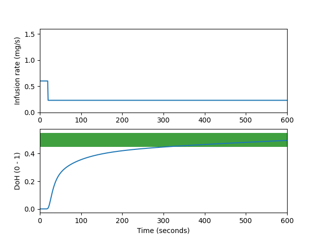

# Anesthesia
This repository is dedicated to my research projects on anesthesia.

The modeling folder includes time-series simulation and an LSTM modeling of time series simulation.

The RL folder is dedicated to implementation of RL algorithm on anesthesia (SISO and MIMO).

**Modeling:**

An LSTM model is trained for time-series simulation of anesthesia. The goal is to combine this LSTM model with a DNN in order to create a generalized simulation of anesthesia using the data of 45 patients provided in pd_model_dataset. These pd models are identified for another purpose in the previously published [paper](10.1007/s10877-023-01083-5).

The module_simulation uses the [Eleveld PK model](10.1016/j.bja.2018.01.018).

**RL:**

This is an implementation of the paper: [Continuous action deep reinforcement learning for propofol dosing during general anesthesia](10.1016/j.artmed.2021.102227)

The test run of one episode of anesthesia is shown in following figure.

Depth of hypnosis (DoH) rises from zero and should be maintained between 0.45 and 0.55. The infusion rate is considerd as the action of the RL agent.
