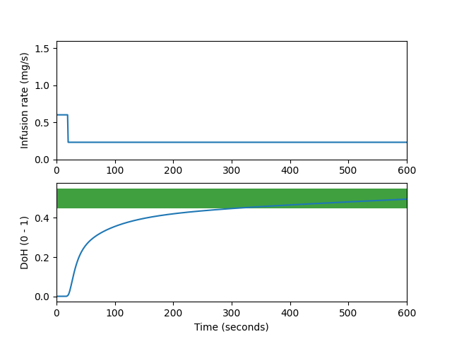

This is an implementation of the paper: [Continuous action deep reinforcement learning for propofol dosing during general anesthesia](10.1016/j.artmed.2021.102227)

The test run of one episode of anesthesia is shown in following figure.

Depth of hypnoisi (DoH) should be between 0.45 and 0.55. The infusion rate is considerd as the action of the RL agent.